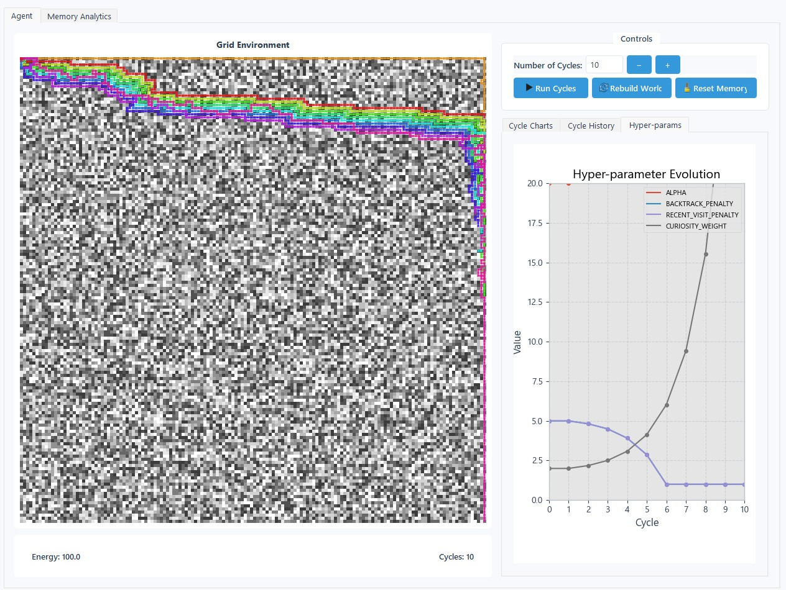

# Hop to it! Hopfield Memory Pathfinder

**Hopfield Memory Pathfinder** is an interactive PyQt5-based simulation where an autonomous agent explores a procedurally generated grid world using memory-guided decision-making. The agent adapts over time by storing experiences, predicting future costs, and optimizing behavior through curiosity, surprise, and reward-driven learning.


---

## Quick Start

```bash
python -m venv venv && source venv/bin/activate
pip install -r requirements.txt
python app_main.py

# Optional reset:
python app_main.py --reset
```

---

## Overview

### Agent Behavior

* Navigates a 150×150 grid of 0–9 shaded cells
* Each shade has a base energy cost between 1–5 units
* Hopfield memory predicts energy cost of unseen cells using:

  * Direction vectors
  * Local shade context
  * Distance to goal
  * Energy level

### Step Evaluation

Each move is scored as:

```
score = cost + surprise + penalty - α(1/(goal_dist + 1)) - curiosity_bonus
```

* Curiosity = variance in Hopfield prediction
* Penalty = backtracking or repeated visits
* Random exploration = 20% chance to pick from top 3 moves

### Restore Rule

If current cell’s shade is evenly divisible by previous shade, agent gets a **one-time full-energy restore** per unique pair.

---

## Persistence & Learning

All state is automatically saved between runs:

| File                      | Contents                             |
| ------------------------- | ------------------------------------ |
| `save/memory.npy`         | Step memory: position, costs, energy |
| `save/cycles.npy`         | Cycle summaries                      |
| `save/world.npy`          | Persistent world grid                |
| `save/cycle_history.json` | UI table of historical cycles        |
| `save/hyper.json`         | Hyperparameter evolution state       |

**HyperScheduler** adapts agent parameters for:

* Reward vs. cost (`ALPHA`)
* Backtracking penalty
* Recent-visit penalty
* Curiosity bonus



---

## User Interface

| Control              | Action                                         |
| -------------------- | ---------------------------------------------- |
| `Run Cycles`         | Perform N full exploration cycles              |
| `Rebuild World`      | Delete and regenerate the grid world           |
| `Reset Memory`       | Wipe memory and start from scratch             |
| **Cycle Table**      | View past cycle stats                          |
| **Live Charts**      | Surprise, energy, distance (per step)          |
| **Hyperparam Plot**  | Line chart of evolving weights                 |
| **Memory Analytics** | Heatmaps, query panel, and memory network view |

---

## Memory Analysis

Launch visual analysis view:

```bash
python app_analysis.py
```

Explore:

* Heatmaps: Cost, Surprise, Visit Count, Error
* Cycle & step breakdowns
* Memory query for any `(x, y)` with full feature vector visualization

---

## Requirements

| Library    | Tested ver. |
| ---------- | ----------- |
| PyQt5      | 5.15        |
| torch      | 2.2         |
| numpy      | 1.26        |
| matplotlib | 3.9         |

---

## License

MIT © [jwest33](https://github.com/jwest33)
