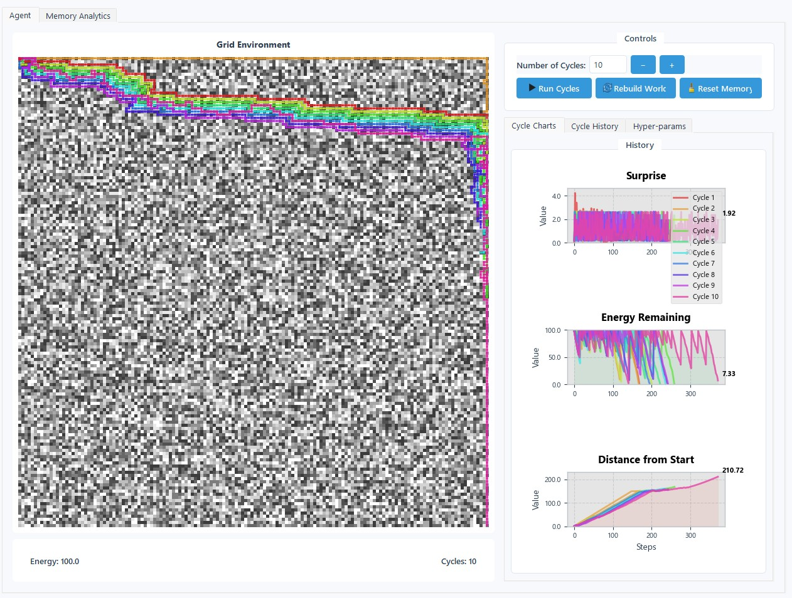
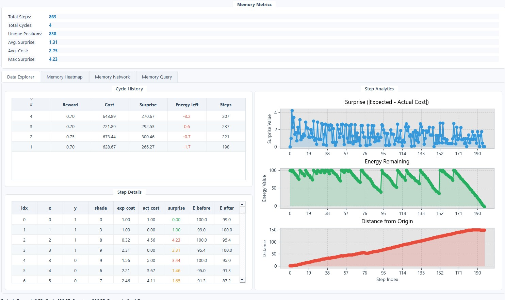
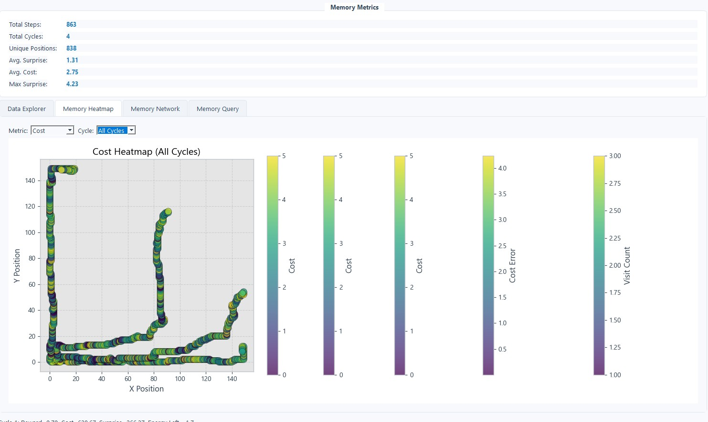

# Hop to it! Hopfield Memory Pathfinder

**Hopfield Memory Pathfinder** is an interactive desktop playground (PyQt 5) where a single agent explores a procedurally generated grid world using a memory-based approach. Watch the agent learn the environment, make decisions based on past experiences, and refine a Hopfield associative memory — all visualized in real time.



---

## Quick Start

```bash
python -m venv venv && source venv/bin/activate
pip install -r requirements.txt
python app_main.py

# Optional: Reset all memory files at startup
python app_main.py --reset
```

| Library    | Tested ver. |
| ---------- | ----------- |
| PyQt5      |  5.15       |
| torch      |  2.2        |
| numpy      |  1.26       |
| matplotlib |  3.9        |

---

## How It Works

1. **GridWorld** assigns an energy cost (1-5 u) to every cell. Moving between shades that divide evenly grants a **one-time full-energy restore**.

2. The **Agent** keeps a Hopfield memory for cell cost prediction and tabular statistics to learn from experiences.

3. **Decision Making** uses a 12-dimensional feature vector that includes direction vectors, cell shade information, surrounding cell data, and energy levels to evaluate potential moves.

4. For each step, the agent:
   - Evaluates all neighboring cells based on memory and goal-seeking behavior
   - Chooses the move that minimizes `(cost + surprise + oscillation) - α·(1.0/(goal_distance + 1.0))`
   - Occasionally selects from the top 3 moves with decreasing probability for exploration
   - Records the actual cost and surprise, updating its memory

5. At cycle end, the agent computes a reward based on the **final distance from origin**, saves the data, teleports home, and resets for the next cycle.

All data are persisted so learning continues across sessions.

---

## User Interface

| Control                               | Action                                                |
| ------------------------------------- | ----------------------------------------------------- |
| **Cycles:** spin box + **Run Cycles** | Run *n* full exploration cycles with live animation   |
| **Rebuild World**                     | Delete the saved grid and generate a new random world |
| **Reset Memory**                      | Wipe all experience, Hopfield memories, and analytics |

Right-hand panels show a sortable history table and four time-series charts:

* **Expected Cost** (for each step)
* **Surprise** (`|expected − actual cost|`)
* **Energy Remaining** (after each step)
* **Distance from Start** (for each step)

---

## Command Line Arguments

You can use the following command line arguments:

| Argument      | Description                             |
| ------------- | --------------------------------------- |
| `--reset`     | Reset all memory files at startup       |

---

## Technical Details

- **Memory Encoding**: Uses a 12-dimensional feature vector to remember cell contexts
- **Adaptive Learning**: Continuously improves cost predictions through Hopfield memory
- **Exploration vs. Exploitation**: Balances between following the best path and exploring alternatives
- **Energy Management**: Strategically seeks energy restores by moving between divisible shade values
- **Visualization**: Real-time display of exploration trails, analytics, and decision-making process

---

## Analysis

```bash
python app_analysis.py
```






---

## License

MIT © [jwest33](https://github.com/jwest33)
