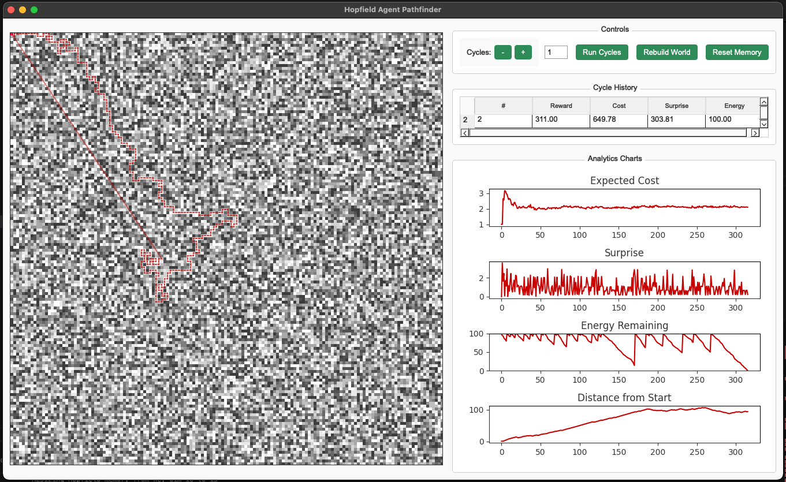

# Hop to it! Hopfield Free‑Energy Pathfinder

**Hopfield Free‑Energy Pathfinder** is an interactive desktop playground (PyQt 5) where a single agent explores a procedurally generated grid world by minimising *Expected Free Energy (EFE)*. Watch the agent learn the environment, form plans, and refine a Hopfield associative memory — all visualised in real time.



---

## Quick Start

```bash
python -m venv venv && source venv/bin/activate
pip install -r requirements.txt
python main.py
```

| Requirement | Tested Version |
| ----------- | -------------- |
| PyQt5       |  5.15          |
| torch       |  2.2           |
| numpy       |  1.26          |
| matplotlib  |  3.9           |

---

## Overview

### 1. GridWorld (`world.py`)

* **Shades 0–9** map linearly to an energy cost of **1 – 5 units**.
* Moving from shade \* a -> b\* restores full energy **once per unique divisible pair** (*b % a == 0*).
* The grid is persisted to `save/world.npy`; delete it (or click **Rebuild World**) to generate a new world.

### 2. Agent (`agent.py`)

| Module           | Role                                                                                                                  |
| ---------------- | ----------------------------------------------------------------------------------------------------------------------|
| `Memory`         | Stores `CellExperience` & `CycleSummary`, serialised to `.npy`.                                                       |
| `HopfieldMemory` | Fixed‑capacity, dot‑product associative memory predicting **future reward** from partial trajectories.                |
| Planner          | Retrieves *cached* plans that still fit current energy or synthesises a new plan via EFE‑weighted greedy exploration. |
| Executor         | Follows the plan, logs experiences, updates energy, and paints the UI.                                                |

> **Expected Free Energy**
> *EFE = expected\_cost + expected\_surprise*
> The planner favours paths that balance energy consumption with epistemic gain.

### 3. GUI (`main.py`)

PyQt 5 + Matplotlib embed provide:

* Timed repaint every 200 ms for animation.
* Live chart updates via a wrapped `Memory.add_experience` callback.
* Persistent `cycle_history.json` analytics.

---

## Data & Persistence

| File / Dir                | Purpose                          |
| ------------------------- | -------------------------------- |
| `save/world.npy`          | Current grid world.              |
| `save/memory.npy`         | Per‑cell experiences.            |
| `save/cycles.npy`         | Cycle summaries (Hopfield keys). |
| `save/cycle_history.json` | GUI table cache.                 |

---

## Configuration

| Env Var / Arg | Default | Meaning                            |
| ------------- | ------- | ---------------------------------- |
| `GRID_SIZE`   |  150    | Width = Height (square world).     |
| `WORLD_SEED`  | random  | RNG seed for deterministic worlds. |
| `MAX_ENERGY`  |  100    | Agent’s starting energy per cycle. |

---

## License

MIT © jwest33. See [`LICENSE`](LICENSE) for details.
